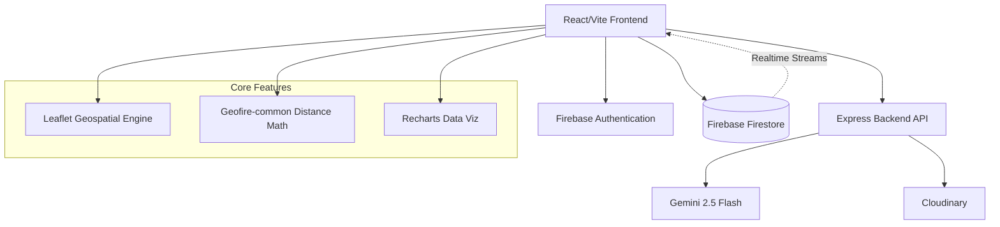
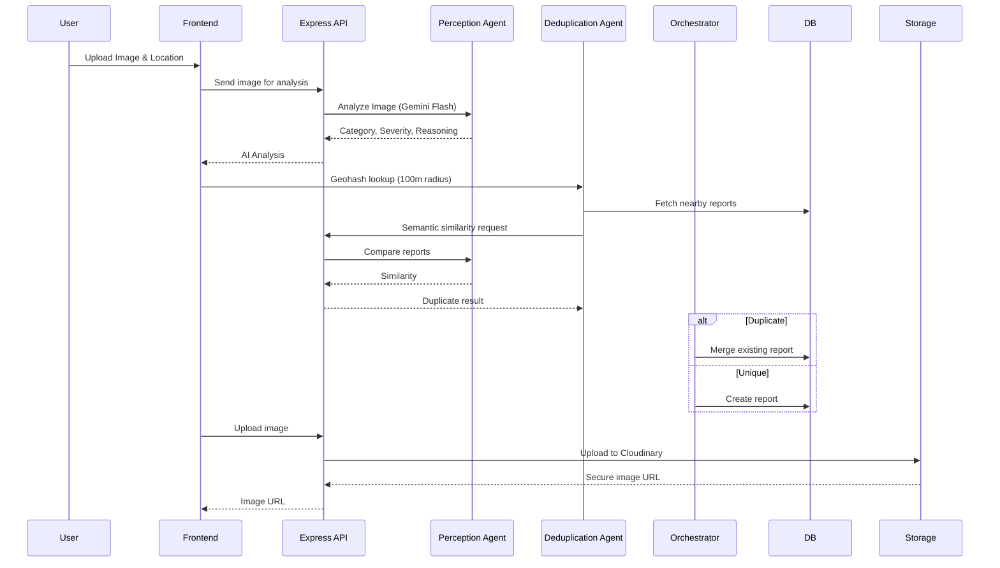
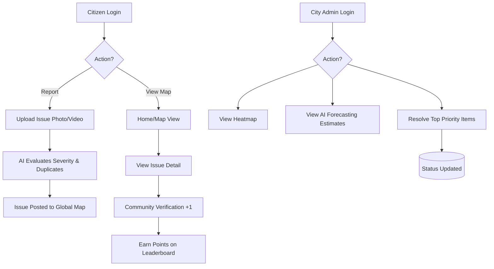

<div align="center">
  
  
  
  
</div>

<div align="center">
  <h1>Civic Pulse</h1>
  <p><strong>Agentic AI-powered civic issue reporting and intelligent city administration</strong></p>
</div>

---

## Overview

Cities struggle with civic issue management—potholes, water leaks, and infrastructure damage are often reported in duplicate, lack standard severity assessments, and overwhelm city administrators with noise. 

**Civic Pulse** solves this by putting an autonomous, multi-agent AI system between citizens and city administration. When a user snaps a photo of an issue, AI perception models extract context (category, severity, reasoning). Geohash-backed AI deduplication algorithms prevent noise, and a predictive admin dashboard forecasts city infrastructure risks over 14 days based on recent patterns.

---

## Features

- [x] **Agentic AI Perception**: Upload a photo; Gemini 2.5 Flash automatically classifies the category, writes a title/description, and scores severity (1-10) with reasoning.
- [x] **Smart AI Deduplication**: Prevents duplicate reports by cross-referencing new reports against open issues within a 100m radius using semantic similarity. Automatically escalates severity if the new image shows deterioration.
- [x] **Multi-Agent Traceability log**: Fully transparent trace engine where users and admins can see the reasoning of the Perception, Deduplication, Severity, and Orchestrator agents.
- [x] **Geospatial Issue Mapping**: Real-time interactive map (powered by Leaflet & Geofire) showing localized issues, colored by severity and status.
- [x] **Admin Predictive Insights Dash**: AI autonomously generates 14-day forecasts for city wards (e.g., "Waterlogging complaints predicted to rise 40%").
- [x] **Priority Queuing & Heatmaps**: Admin view features dynamic resolution tracking, risk scoring, and a geospatial heatmap of critical issues.
- [x] **Community Verification Engine**: Citizens can visually confirm nearby issues (+1) to build community trust scores and crowd-source validation.
- [x] **Gamified Leaderboard**: Users earn points for reporting accurately and verifying community issues.

---

## Architecture

[INSERT ARCHITECTURE DIAGRAM]





## Dedicated Python Multi-Agent Workflow Engine

Civic Pulse features a dedicated, server-side Python Multi-Agent Workflow Engine (`server/`) powered by FastAPI and the official `google-genai` Python SDK:

```
server/
├── main.py                          # FastAPI server & CORS setup
├── config.py                        # Environment & GenAI settings
├── requirements.txt                 # Python dependencies
├── agents/                          # Modular Agent Classes
│   ├── base.py                      # BaseAgent abstract class & trace formatting
│   ├── perception_agent.py          # PerceptionAgent (multimodal image perception & scoring)
│   ├── deduplication_agent.py       # DeduplicationAgent (spatial distance & semantic similarity)
│   ├── severity_agent.py            # SeverityAgent (visual urgency & escalation logic)
│   ├── forecasting_agent.py         # ForecastingAgent (14-day ward infrastructure forecasting)
│   └── orchestrator_agent.py        # OrchestratorAgent (pipeline state & trace compilation)
├── workflows/                       # Orchestrated Multi-Agent Pipelines
│   ├── report_processing_workflow.py# Sequential multi-agent report pipeline
│   └── ward_forecasting_workflow.py # Ward analytics forecasting pipeline
└── routes/                          # FastAPI REST endpoints (/api/v1/agents/*)
```

### What the AI Agents Actually Do

#### 1. Perception Agent (`perception_agent.py`)
- **Trigger**: Called when a citizen uploads an image for an issue (`/api/v1/agents/perceive`).
- **Action**: Converts image bytes and sends to Gemini 2.5 Flash via `google-genai` SDK with strict Pydantic JSON schemas.
- **Output**: Returns structured classification object: `category`, `severity` (1-10), `title`, `description`, and `reasoning`.

#### 2. Deduplication Agent (`deduplication_agent.py`)
- **Trigger**: Executed during report submission pipeline (`/api/v1/agents/process-report`).
- **Action**: Calculates spatial distances using Haversine formula for reports within 100 meters, then passes descriptions to Gemini 2.5 Flash for semantic comparison.
- **Output**: Returns `similarity` score (0 to 1) and `isDuplicate` flag (true if similarity > 0.8).

#### 3. Severity & Escalation Agent (`severity_agent.py`)
- **Trigger**: Evaluated when a duplicate report is detected during pipeline execution.
- **Action**: Compares visual severity score of new report against candidate score.
- **Output**: If new report indicates visual deterioration ($\ge 2$ level jump), escalates existing report's severity score and logs reasoning.

#### 4. Orchestrator Agent (`orchestrator_agent.py`)
- **Trigger**: Manages pipeline state during `ReportProcessingWorkflow`.
- **Action**: Synthesizes output from Perception, Deduplication, and Severity agents into unified decision (`CREATE` or `MERGE`).
- **Output**: Constructs an immutable, timestamped `agentTrace` array saved directly into Firestore.

#### 5. Forecasting Agent (`forecasting_agent.py`)
- **Trigger**: Executed during admin dashboard sweeps (`/api/v1/agents/forecast`).
- **Action**: Analyzes 20 recent reports per ward using Gemini 2.5 Flash.
- **Output**: Generates a 14-day infrastructure risk forecast containing `category`, `trend` (`increasing` | `stable` | `decreasing`), `confidence`, and analytical `reasoning`.

---

## License
This project is free software and available under the **GNU General Public License v3.0** (GPL-3.0). See the [LICENSE](LICENSE) file for more details.
